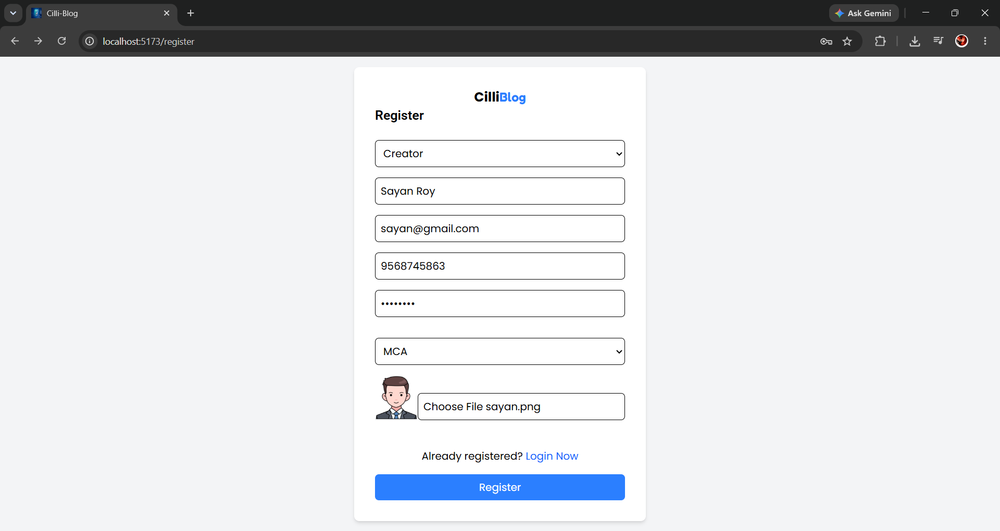
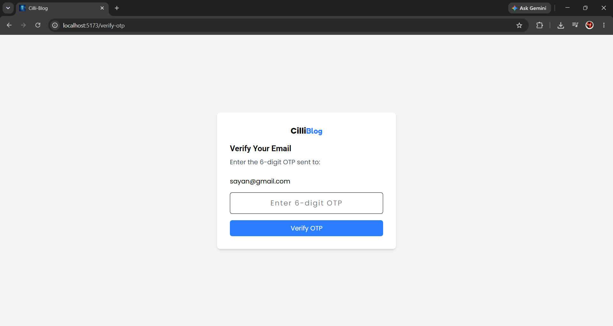
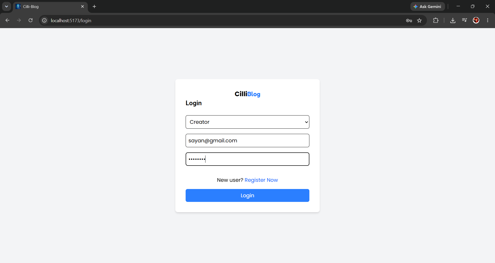
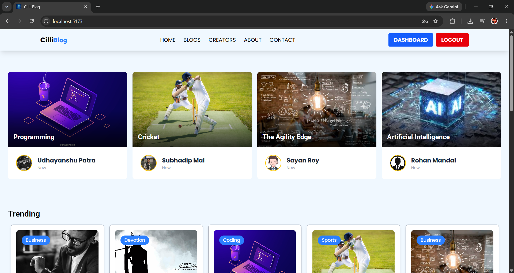
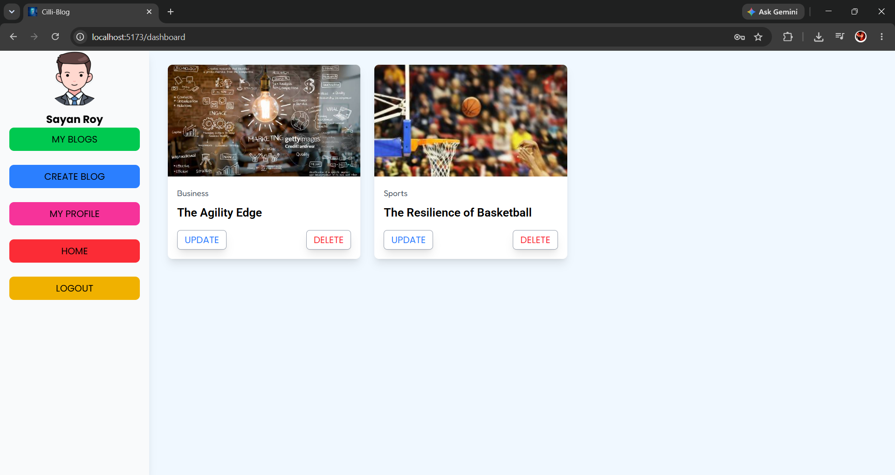
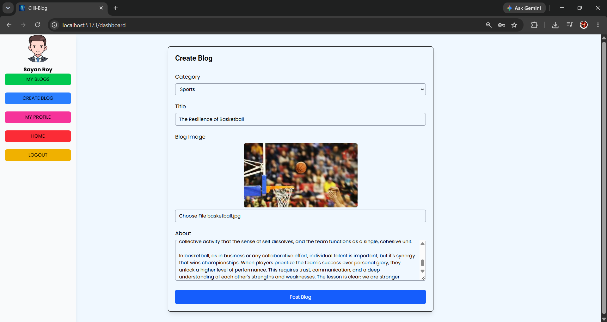
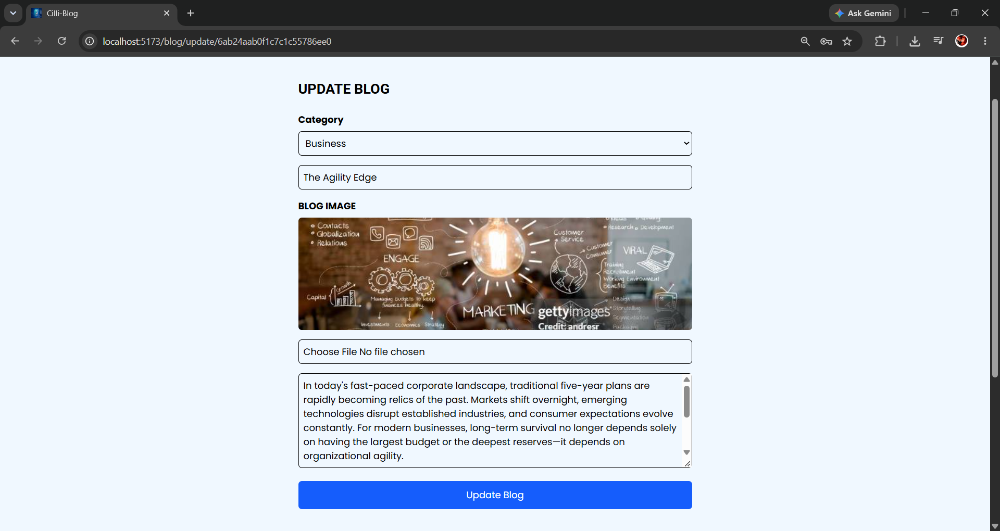
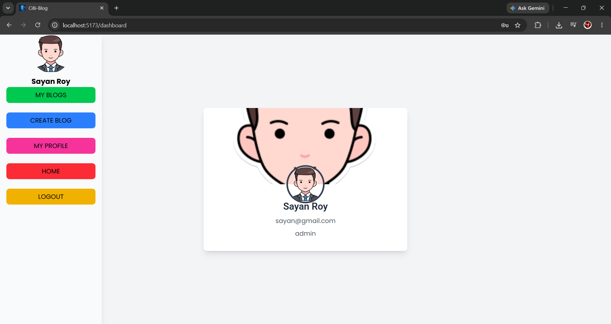
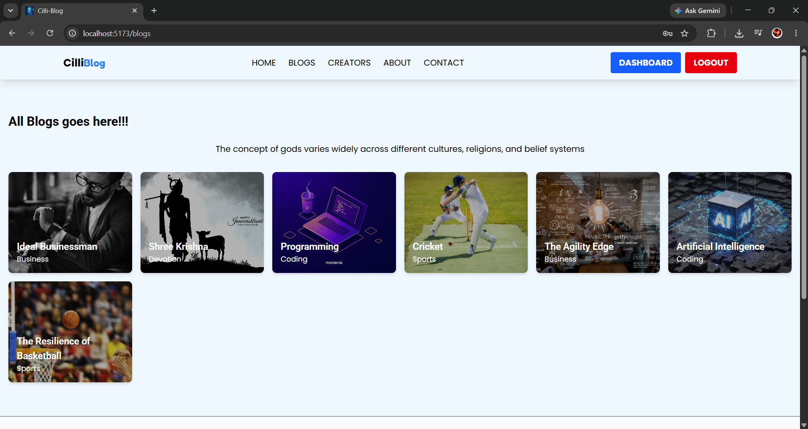
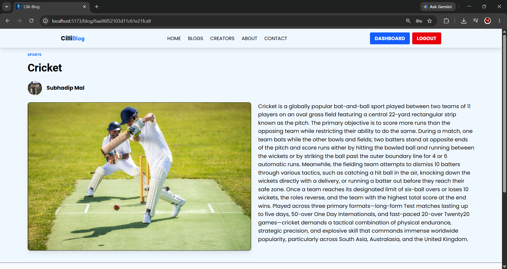

# CilliBlog

**CilliBlog is a full-stack blogging platform built with the MERN stack. It allows users to explore blogs, while authorized creators can create, update, and manage their own blog posts through a dedicated dashboard.**

The project focuses on implementing real-world full-stack concepts such as authentication, role-based authorization, CRUD operations, image uploading, protected routes, REST APIs, and responsive Ul design.

---

## 🚀 Features

### 👤 Reader Features

* User registration and login
* JWT-based authentication
* HTTP-only cookie-based authentication
* View user profile
* Browse all blogs
* Read detailed blog posts
* Responsive user interface

### ✍️ Creator Features

* Creator/Admin registration
* Email OTP verification
* Create blog posts
* Update your own blogs
* Delete blogs
* Manage personal blogs
* Upload blog images
* Update existing blog images
* Dedicated creator dashboard

### 🔐 Authentication & Security

* JWT authentication
* HTTP-only cookies
* Protected routes
* Role-based authorization
* Email OTP verification
* Password hashing with bcrypt
* Email validation
* Unique email and phone validation
* Form validation

### 🖼️ Image Management

* Cloudinary image upload
* Blog image update
* Automatic deletion of replaced Cloudinary images
* User profile image support

---

# 🛠️ Tech Stack

## Frontend

| Technology               | Purpose                      |
| ------------------------ | ---------------------------- |
| **React **               | Frontend UI                  |
| **Vite**                 | Development & build tool     |
| **Tailwind CSS **        | Styling                      |
| **React Router DOM **    | Client-side routing          |
| **Axios**                | API requests                 |
| **React Hook Form**      | Form handling                |
| **React Hot Toast**      | Notifications                |
| **React Icons**          | Icons                        |
| **React Multi Carousel** | Responsive carousels         |
| **JS Cookie**            | Client-side cookie utilities |

## Backend

| Technology             | Purpose               |
| ---------------------- | --------------------- |
| **Node.js**            | Backend runtime       |
| **Express **           | REST API              |
| **MongoDB Atlas**      | Database              |
| **Mongoose**           | MongoDB ODM           |
| **JWT**                | Authentication        |
| **bcryptjs**           | Password hashing      |
| **Cloudinary**         | Image storage         |
| **Express FileUpload** | File uploading        |
| **Cookie Parser**      | Cookie handling       |
| **CORS**               | Cross-origin requests |
| **Nodemailer**         | Email & OTP           |
| **Validator**          | Input validation      |
| **dotenv**             | Environment variables |
| **Nodemon**            | Development server    |

## Development Tools

* Git
* GitHub
* Postman
* VS Code

---

# 📂 Project Structure

```text
CilliBlog/
│
├── Frontend/
│   ├── public/
│   ├── src/
│   │   ├── components/
│   │   ├── context/
│   │   ├── dashboard/
│   │   ├── home/
│   │   ├── pages/
│   │   ├── App.jsx
│   │   └── main.jsx
│   │
│   ├── package.json
│   └── vite.config.js
│
├── Backend/
│   ├── controller/
│   ├── config/
│   ├── jwt/
│   ├── middleware/
│   ├── models/
│   ├── routes/
│   ├── utils/
│   ├── index.js
│   ├── package.json
│   └── .env
│
└── README.md
```

---

# 🔑 Application Flow

## Authentication Flow

```text
User
 │
 ├── Register
 │
 ├── Login
 │
 └── JWT Authentication
          │
          ↓
    HTTP-only Cookie
          │
          ↓
    Protected Routes
```

## Creator Registration Flow

```text
Creator
   │
   ↓
Registration
   │
   ↓
Email OTP
   │
   ↓
OTP Verification
   │
   ↓
Create Creator Account
   │
   ↓
Creator Dashboard
```

## Blog Management Flow

```text
Creator
   │
   ├── Create Blog
   │      │
   │      ├── Blog Details
   │      │
   │      └── Upload Image
   │               ↓
   │           Cloudinary
   │
   ├── Update Blog
   │
   └── Delete Blog
```

---

# 📋 Blog Categories

* 🏅 Sports
* 💻 Coding
* 📻 Entertainment
* 🙏 Devotion
* 🈺 Business

---

# ⚙️ Installation & Setup

## 1. Clone the Repository

```bash
git clone https://github.com/shubhahazra/blog-app.git
```

Move into the project:

```bash
cd blog-app
```

---

# 🖥️ Frontend Setup

Navigate to the frontend:

```bash
cd Frontend
```

Install dependencies:

```bash
npm install
```

Start the development server:

```bash
npm run dev
```

The frontend will be available at:

```text
http://localhost:5173
```

### Frontend Scripts

```bash
npm run dev
```

---

# ⚙️ Backend Setup

Open another terminal and navigate to the backend:

```bash
cd Backend
```

Install dependencies:

```bash
npm install
```

Start the backend:

```bash
npm start
```

The backend runs on:

```text
http://localhost:4001
```

### Backend Script

```bash
npm start
```

The backend uses **Nodemon** to automatically restart the server during development.

---

# 🔐 Environment Variables

Create a `.env` file inside the `Backend` directory.

```env
PORT=4001

MONGO_URI=your_mongodb_connection_string

JWT_SECRET=your_jwt_secret

CLOUDINARY_CLOUD_NAME=your_cloudinary_cloud_name
CLOUDINARY_API_KEY=your_cloudinary_api_key
CLOUDINARY_API_SECRET=your_cloudinary_api_secret

EMAIL_USER=your_email
EMAIL_PASS=your_email_app_password
```

---

# 🔗 API Overview

The backend provides REST APIs for user authentication, creator management, and blog operations.

## 👤 User & Authentication APIs

| Method | Endpoint                      | Description                      |
| ------ | ----------------------------- | -------------------------------- |
| POST   | `/api/users/register`         | Register a new user              |
| POST   | `/api/users/login`            | Login user                       |
| GET    | `/api/users/logout`           | Logout authenticated user        |
| GET    | `/api/users/my-profile`       | Get authenticated user's profile |
| GET    | `/api/users/admins`           | Get all admins                   |
| POST   | `/api/users/admin/verify-otp` | Verify admin registration OTP    |

## ✍️ Blog APIs

| Method | Endpoint                     | Description                                  |
| ------ | ---------------------------- | -------------------------------------------- |
| POST   | `/api/blogs/create`          | Create a new blog                            |
| DELETE | `/api/blogs/delete/:id`      | Delete a blog                                |
| GET    | `/api/blogs/all-blogs`       | Get all blogs                                |
| GET    | `/api/blogs/single-blog/:id` | Get a single blog                            |
| GET    | `/api/blogs/my-blog`         | Get blogs created by the authenticated admin |
| PUT    | `/api/blogs/update/:id`      | Update a blog                                |

---

# 🔒 Role-Based Authorization

CilliBlog uses role-based access control.

### Reader

A reader can:

* Register
* Login
* View blogs
* Read blog details
* View their profile

### Creator/Admin

A creator can additionally:

* Create blogs
* Update their own blogs
* Delete blogs
* Manage their blogs
* Upload images
* Access the creator dashboard

---

# ☁️ Cloudinary Integration

CilliBlog uses **Cloudinary** to store blog and profile images.

The image flow is:

```text
Frontend
   ↓
Backend
   ↓
Express FileUpload
   ↓
Cloudinary
   ↓
Image URL + Public ID
   ↓
MongoDB
```

When an existing blog image is replaced, the previous Cloudinary image can be removed to prevent unnecessary storage.

---

# 📡 Axios & API Communication

The frontend communicates with the backend using **Axios**.

```text
React Frontend
      │
      ↓
    Axios
      │
      ↓
Express REST API
      │
      ↓
   MongoDB
```

Authentication cookies are included with requests that require the logged-in user's session.

---

# 📱 Responsive Design

CilliBlog is designed to work across:

* 💻 Desktop
* 💻 Laptop
* 📱 Mobile

The frontend uses **Tailwind CSS** for responsive styling.

---

# 🎯 Key Concepts Implemented

This project helped me practice and implement:

* MERN stack development
* React component architecture
* React Context API
* React Router
* Protected routes
* REST API development
* JWT authentication
* HTTP-only cookies
* Role-based authorization
* MongoDB atlas
* Mongoose
* CRUD operations
* File uploads
* Cloudinary integration
* Nodemailer
* OTP verification
* Axios
* Axios interceptors
* React Hook Form
* Form validation
* Error handling
* Responsive UI design
* Git & GitHub
* API testing with Postman

---

# 🔮 Future Improvements

Possible future features include:

* 💬 Blog comments
* ❤️ Like functionality
* 🔖 Bookmark blogs
* 🔎 Advanced search
* 📄 Pagination
* 🔔 Notifications
* 👥 Follow creators
* 📊 Creator analytics
* 🛡️ Additional security improvements

---

# 👨‍💻 Author

## Shubha Hazra

**BCA Student | MERN Stack Developer**

### Connect With Me

* GitHub: `https://github.com/shubhahazra`
* LinkedIn: `https://www.linkedin.com/in/shubha-hazra/`

---

# ⭐ Support

If you find **CilliBlog** useful or interesting, consider giving the repository a ⭐ on GitHub.

---

# 📚 Project Purpose

This project was created for **learning and portfolio purposes**.


# 📸 Screenshots

## 📝 Register



## 🔐 Verify OTP



## 🔑 Login



## 🏠 Home



## 📊 Dashboard



## ✍️ Create Blog



## 📝 Update Blog



## 👤 Profile



## 📚 All Blogs



## 📖 Blog Detail


